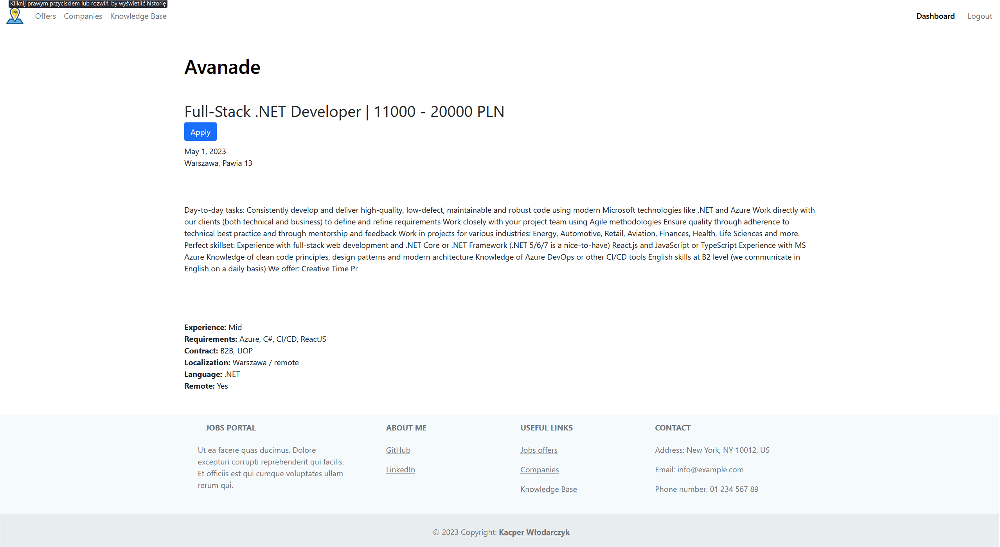
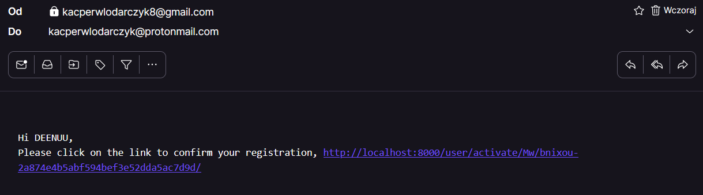

[![Stargazers][stars-shield]][stars-url]
[![Issues][issues-shield]][issues-url]
[![MIT License][license-shield]][license-url]
[![LinkedIn][linkedin-shield]][linkedin-url]


<br />
<div align="center">
  <a href="https://github.com/DEENUU1/">
    
  </a>

  <h3 align="center">Django Jobs Portal</h3>

  <p align="center">
    Get your dream job in just a few clicks!
    <br />
    <br />
    <a href="https://github.com/DEENUU1/Jobs-portal/issues">Report Bug</a>
    ·
    <a href="https://github.com/DEENUU1/Jobs-portal/issues">Request Feature</a>
  </p>
</div>


<!-- TABLE OF CONTENTS -->

### Table of Contents
  <ol>
    <li>
      <a href="#about-the-project">About The Project</a>
      <ul>
        <li><a href="#built-with">Built With</a></li>
      </ul>
    </li>
    <li><a href="#key-features">Key features</a></li>
    <li>
      <a href="#getting-started">Getting Started</a>
      <ul>
        <li><a href="#installation">Installation</a></li>
        <li><a href="#configuration">Configuration</a></li>
      </ul>
    </li>
    <li><a href="#unit-tests">Tests</a></li>
    <li><a href="#acknowledgments">Acknowledgments</a></li>
    <li><a href="#license">License</a></li>
    <li><a href="#author">Author</a></li>
  </ol>


<!-- ABOUT THE PROJECT -->
## About The Project




This project allows companies to add job offers and manage applications from candidates. The company can also generate reports in the form of a .csv file for each offer.
On the other hand, users can filter, search, and apply for jobs, as well as rate companies and write reviews.
Thanks to the use of Celery and Redis technologies, the application can send an asynchronous e-mail with confirmation when registering an account.

### Built With
- Python
- Django
- Celery
- Redis
- HTML & Bootstrap

## Key Features
### Company:
  - Creating, editing and deleting offers
  - Managing the applications from users
  - Sending Feedback thanks to Celery and Redis
  - Downloading candidates' data to CSV format
### User:
  - Applying for offers
  - Browsing learning resources 

### Other:
  - Sending activation link after registration
  - Email and password changes 
  - Filtering offers via date, languages, localization and more 

```python
@shared_task()
def send_email_task(email, subject, message):
    """
    A Celery task that sends an email to a specified email address with a given subject and message.
    Parameters:
        email: A string containing the email address to send the email to.
        subject: A string containing the subject of the email.
        message: A string containing the message to be included in the email.
    """
    send_mail(subject, message, settings.EMAIL_HOST_USER, [email])
```



<!-- GETTING STARTED -->
## Getting Started

If you want to use this project, follow me.


### Installation


First you need to clone this repository
```bash
git clone <link>
```

### Configuration
1. Add .env file in the base directory (there were settings.py)
```bash
SECURITY_CODE=<DJANGO-SECURITY-CODE-HERE>
GMAIL_PASSWORD=<YOUR-GMAIL-PASSWORD-HERE>
GMAIL_EMAIL=<YOUR-GMAIL-EMAIL-HERE>
```
2. Go to the main directory
```bash
cd base
```
3. Then install all requirements 
```bash
pip install -r requirements.txt
```
4. Make migrations 
```bash
python manage.py makemigrations
python manage.py migrate
```
5. Create superuser
```bash
python manage.py createsuperuser
```

### If you want to use docker just use this command
```bash
docker-compose up
```

## Unit tests
To run unit tests you need to use this command
```bash
python manage.py test <APPLICATION_NAME>.tests
```
You can run tests for applications:
- offers
- dashboard
- accounts
- study


<!-- ACKNOWLEDGMENTS -->
## Acknowledgments

Use this space to list resources you find helpful and would like to give credit to. I've included a few of my favorites to kick things off!

* [First steps with Django and Celery](https://docs.celeryq.dev/en/stable/django/first-steps-with-django.html)
* [Celery step by step](https://realpython.com/asynchronous-tasks-with-django-and-celery/)
* [Django, docker, celery, redis and postgresql](https://soshace.com/dockerizing-django-with-postgres-redis-and-celery/)


<!-- LICENSE -->
## License

Distributed under the MIT License. See `LICENSE.txt` for more information.


## Author

- [@DEENUU1](https://www.github.com/DEENUU1)


<!-- MARKDOWN LINKS & IMAGES -->
<!-- https://www.markdownguide.org/basic-syntax/#reference-style-links -->
[contributors-shield]: https://img.shields.io/github/contributors/DEENUU1/Jobs-portal.svg?style=for-the-badge
[contributors-url]: https://github.com/DEENUU1/Jobs-portal/graphs/contributors
[forks-shield]: https://img.shields.io/github/forks/DEENUU1/Jobs-portal.svg?style=for-the-badge
[forks-url]: https://github.com/DEENUU1/Jobs-portal/network/members
[stars-shield]: https://img.shields.io/github/stars/DEENUU1/Jobs-portal.svg?style=for-the-badge
[stars-url]: https://github.com/DEENUU1/Jobs-portal/stargazers
[issues-shield]: https://img.shields.io/github/issues/DEENUU1/Jobs-portal.svg?style=for-the-badge
[issues-url]: https://github.com/DEENUU1/Jobs-portal/issues
[license-shield]: https://img.shields.io/github/license/DEENUU1/Jobs-Portal.svg?style=for-the-badge
[license-url]: https://github.com/DEENUU1/DEENUU1/blob/master/LICENSE.txt
[linkedin-shield]: https://img.shields.io/badge/-LinkedIn-black.svg?style=for-the-badge&logo=linkedin&colorB=555
[linkedin-url]: https://www.linkedin.com/in/kacper-wlodarczyk/
